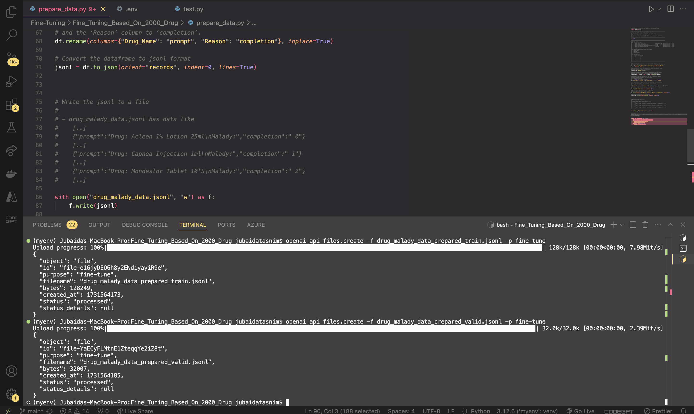
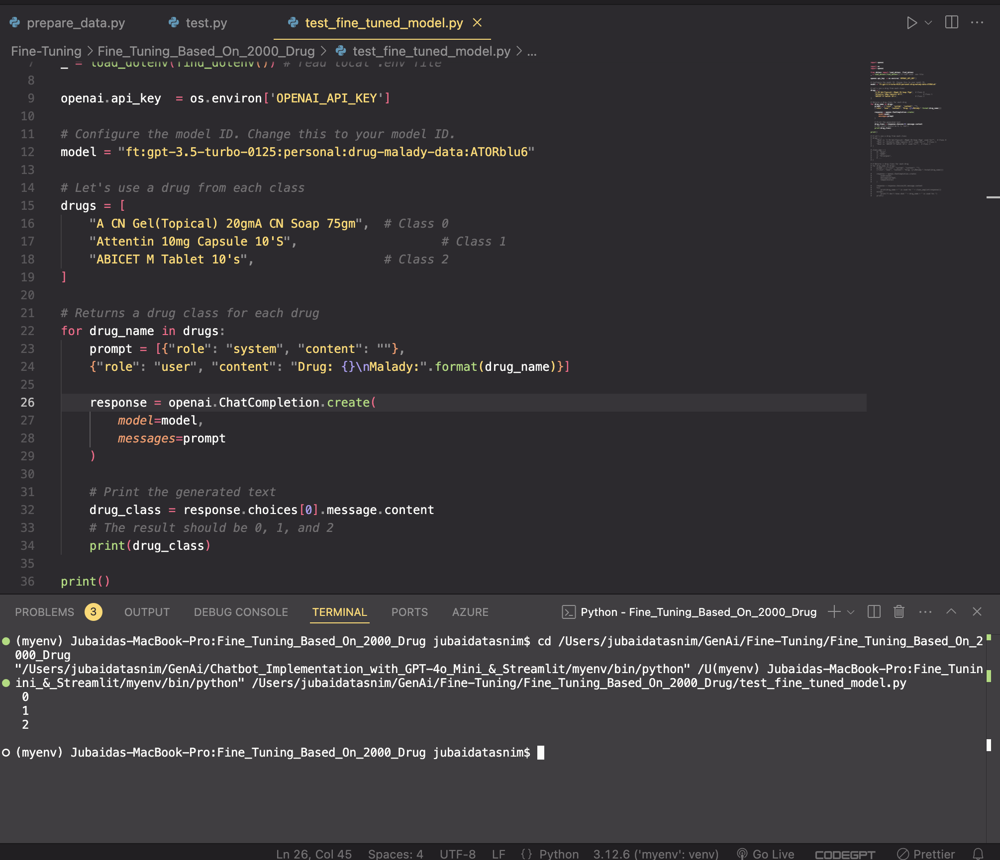
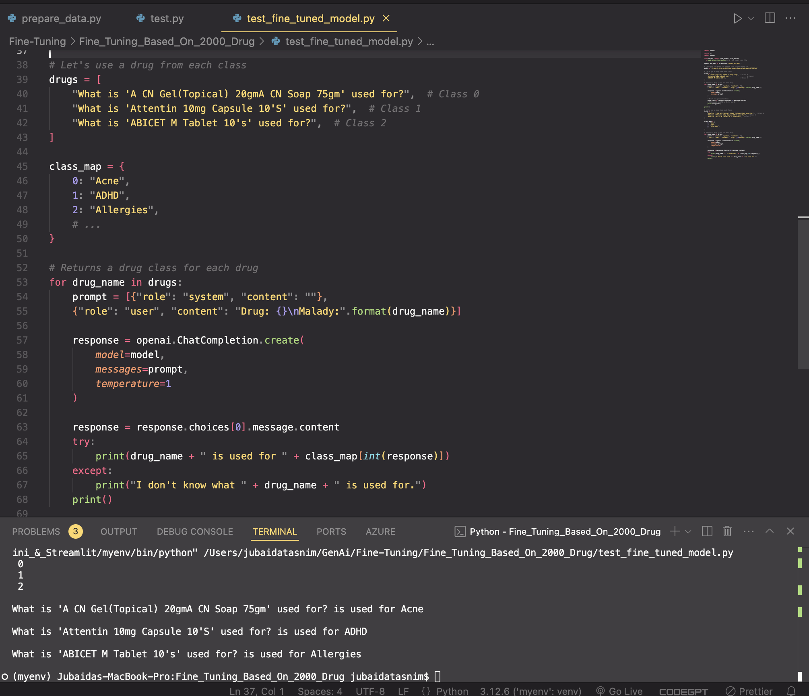

# Fine-Tuning a Model Based on 2000 Drug Examples

This project aims to fine-tune an AI model using 2000 drug examples to classify drug indications effectively. The model, fine-tuned with drug names and corresponding maladies, can predict the primary purpose or indication of a drug based on input text.

## Project Overview

- **Objective**: Fine-tune a machine learning model to classify drug indications accurately.
- **Data**: 2000 drug examples provided in an Excel file.
- **Model**: OpenAI's `ada` model, chosen for its balance between cost-effectiveness and performance.
- **Format**: Data is converted to JSONL format with prompt-completion pairs for model training.

## Installation

```bash
        git clone https://github.com/JTasnim/Fine-Tuning-Based-On-2000-Drug.git

        pip install openai pandas scikit-learn

        export OPENAI_API_KEY="your_openai_api_key"
```

## Data Preparation

1 Convert Excel Data to JSONL Format

Run prepare_data.py to transform the drug data from Excel to JSONL format, suitable for fine-tuning:

json:

{"prompt": "Drug: <DRUG NAME>\\nMalady:", "completion": " <MALADY ID>"}

2 Split Data into Training and Validation Sets

Use divide_data.py to split the JSONL file into training (80%) and validation (20%) datasets.

## Fine-Tuning Process

1 Prepare Data for Fine-Tuning

Analyze and prepare the data with OpenAI’s fine-tuning preparation tool:

```bash
    openai tools fine_tunes.prepare_data -f data/drug_malady_data.jsonl
```

2 Train the Model

Fine-tune the model with the prepared data:

```bash
openai api fine_tunes.create \
   -t "data/drug_malady_data_prepared_train.jsonl" \
   -v "data/drug_malady_data_prepared_valid.jsonl" \
   -m ada \
   --suffix "drug_malady_data"
```

3 Monitor Training Progress

Track the fine-tuning job:

```bash
openai api fine_tunes.follow -i <JOB ID>
```

## Testing the Model

Use test_model.py to evaluate the fine-tuned model. Here’s an example of how to test with sample drug names:

import openai

## Replace with your fine-tuned model ID

    #Replace with your fine-tuned model ID
    model = "ada:ft-your-organization:drug-malady-data-YYYY-MM-DD-HH-MM-SS"
    drugs = ["A CN Gel(Topical) 20gmA CN Soap 75gm", "Addnok Tablet 20'S", "ABICET M Tablet 10's"]

    for drug_name in drugs:
        prompt = [{"role": "system", "content": ""},
        {"role": "user", "content": "Drug: {}\nMalady:".format(drug_name)}]

        response = openai.ChatCompletion.create(
            model=model,
            messages=prompt
        )

        drug_class = response.choices[0].message.content
        print(drug_class)

## Screenshot of execution results







## To learn more

[Google Slide](./assets/Fine-tuning-model-based-on-2000-drug.pptx)
